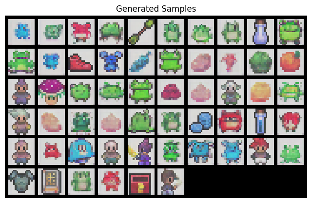

# PixelGen16x16

## Overview

**PixelGen16x16** is a simple diffusion model for generating **16x16 pixel art**. This project demonstrates how diffusion models can be leveraged for low-resolution pixel art generation, offering an efficient and creative approach to sprite and icon creation.

## Features

- Generates **16x16 pixel art** with a diffusion model.
- Utilizes **PyTorch** and **Diffusers** library.
- Supports training on custom datasets.
- Simple and lightweight implementation.

## Usage

### Run on Kaggle

